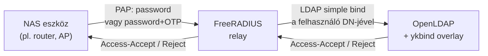
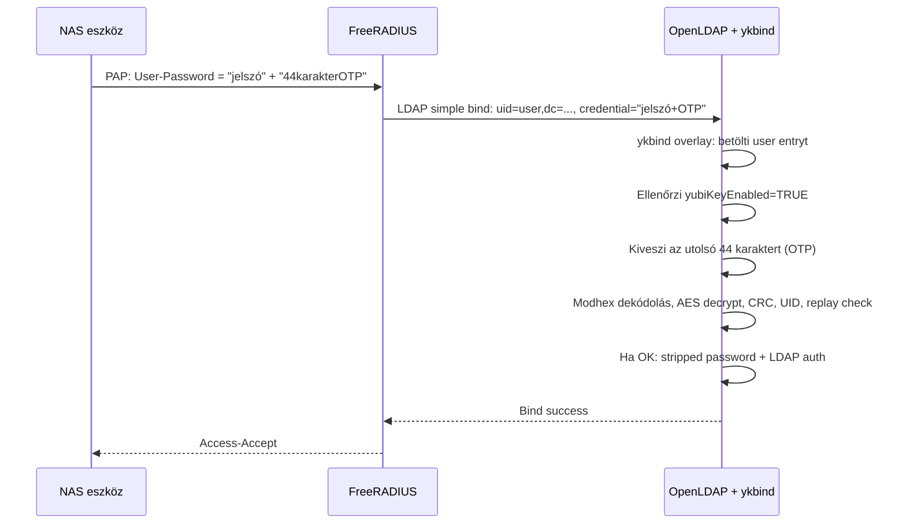
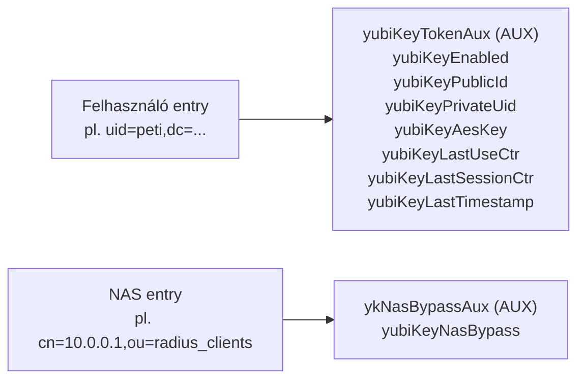

# OpenLDAP YubiKey OTP Stack

[English README](README.md)

## Architektúra



Két konténer egy Docker Compose stackben:

| Konténer | Szerep |
|----------|--------|
| `openldap-ykbind` | OpenLDAP szerver `ykbind` overlay modullal |
| `freeradius-ldap` | FreeRADIUS relay (opcionális) |

A FreeRADIUS **nem** végzi a YubiKey validálást — csak továbbítja a PAP credentialt LDAP simple bindként. A döntés az LDAP oldalon történik.

## YubiKey OTP validáció menete



Ha a felhasználónak nincs YubiKey engedélyezve:
- Az overlay `SLAP_CB_CONTINUE`-t ad vissza
- A sima LDAP bind lefut a teljes credentialdel
- A jelszó egyezését az OpenLDAP beépített `userPassword` összehasonlítása végzi

Ha a NAS eszköz csak 20 karakteres jelszót támad (nem fér bele az OTP):
- [Per-NAS bypass](#per-nas-yubikey-bypass) funkcióval kikapcsolható a YubiKey validáció arra a NAS-ra
- Ilyenkor FreeRADIUS `Auth-Type=PAP`-t használ, és a `pap` modul hasonlítja össze a jelszót az LDAP-ból lekért hash-sel
- Nincs LDAP bind → az overlay nem fut le

## Séma



### Attribútumok

| OID | Név | Típus | Értelmezés |
|-----|-----|-------|------------|
| `.1.1` | `yubiKeyEnabled` | boolean | YubiKey OTP kikényszerítése |
| `.1.2` | `yubiKeyPublicId` | string (modhex) | YubiKey publikus azonosítója |
| `.1.3` | `yubiKeyPrivateUid` | string (hex) | Privát UID (6 byte) |
| `.1.4` | `yubiKeyAesKey` | string (hex) | AES-128 kulcs (16 byte, 32 hex char) |
| `.1.5` | `yubiKeyLastUseCtr` | integer | Utolsó use counter |
| `.1.6` | `yubiKeyLastSessionCtr` | integer | Utolsó session counter |
| `.1.7` | `yubiKeyLastTimestamp` | integer | Utolsó timestamp |
| `.1.10` | `yubiKeyNasBypass` | boolean | NAS kivétele YubiKey alól |

### Objektum osztályok

| OID | Név | MAY |
|-----|-----|-----|
| `.2.1` | `yubiKeyTokenAux` | `yubiKeyEnabled` + key material + counters |
| `.2.2` | `ykNasBypassAux` | `yubiKeyNasBypass` |

## Repository struktúra

```
.
├── ansible/                     # Ansible role + playbook
│   ├── playbooks/deploy-openldap.yml
│   └── roles/openldap_docker/
│       ├── defaults/main.yml    # Minden változó itt
│       ├── tasks/               # Deploy lépések
│       └── templates/           # LDIF + FreeRADIUS template-ek
├── schema/
│   ├── yubikey-otp.schema       # Slapd schema formátum
│   └── yubikey-otp.ldif         # cn=config LDIF formátum
├── docker/
│   ├── openldap/                # OpenLDAP image build
│   └── freeradius/              # FreeRADIUS image build
├── radius/                      # FreeRADIUS config overrides
├── slapo-ykbind.c               # Overlay forráskód (C)
├── exports/                     # LDIF exportok ide
└── tools/                       # Helper scriptek
```

## Deploy módok

A playbook három módot támogat:

### full_import

Friss telepítés. Törli a meglévő adatokat, bootstrappel egy tiszta `cn=config`-ot, importálja a sémát, betölti a teljes LDIF fájlt, konfigurálja az overlay-t.

```bash
cd ansible
ansible-playbook playbooks/deploy-openldap.yml \
  -e ldap_deploy_mode=full_import \
  -e ldap_admin_password='<jelszó>' \
  -e ldap_ldif_import_file=exports/full-tree.ldif
```

### adopt_existing

Meglévő OpenLDAP átvétele. Nem töröl adatot, nem futat full importot. Csak a konténer image-et frissíti és a mountokat állítja be.

```bash
cd ansible
ansible-playbook -i inventory/hosts.ini playbooks/deploy-openldap.yml \
  -e ldap_deploy_mode=adopt_existing
```

### maintenance

Karbantartás. Nem épít új image-et, nem töröl adatot. Frissíti a Compose fájlt, TLS anyagot, LDIF konfigokat. Csak `ldap_maintenance_restart_container=true`-val indítja újra a konténert.

```bash
cd ansible
ansible-playbook -i inventory/hosts.ini playbooks/deploy-openldap.yml \
  -e ldap_deploy_mode=maintenance \
  -e ldap_maintenance_restart_container=true
```

## FreeRADIUS relay működése

A FreeRADIUS nem csinál mást, mint:
1. Fogadja a PAP kérést a NAS-tól
2. `authorize` fázis: LDAP search a felhasználóért, attribútumok lekérése
3. LDAP simple bind a felhasználó DN-jével és a megkapott credentialdel
4. Az `ykbind` overlay eldönti, kell-e OTP
5. Eredmény továbbítása vissza a NAS-nak

### Per-NAS YubiKey bypass

Ha egy NAS eszköz (pl. régi router) csak 20 karakteres jelszót támad:

1. Add hozzá a NAS entryhez LDAP-ban:

```ldif
dn: cn=10.0.0.1,ou=radius_clients,dc=example,dc=org
changetype: modify
add: objectClass
objectClass: ykNasBypassAux
-
add: yubiKeyNasBypass
yubiKeyNasBypass: TRUE
```

2. Futtass maintenance deploy-t:

```bash
cd ansible
ansible-playbook playbooks/deploy-openldap.yml \
  -e ldap_deploy_mode=maintenance \
  -e ldap_maintenance_restart_container=true
```

Ekkor FreeRADIUS `Auth-Type=PAP`-t használ erre a NAS-ra, ami a jelszót közvetlenül a `userPassword` hash-sel hasonlítja össze — az overlay nem fut le.

**Fontos**: Csak azokhoz a NAS entrykhez add hozzá, amik tényleg nem támogatják az OTP-t. A többi NAS változatlanul YubiKey validációval működik.

A bypass kikapcsolható: `radius_yubikey_nas_bypass_enabled: false`

## Felhasználó hozzáadása YubiKey-jel

```ldif
dn: uid=peti,ou=people,dc=example,dc=org
changetype: modify
add: objectClass
objectClass: yubiKeyTokenAux
-
add: yubiKeyEnabled
yubiKeyEnabled: TRUE
-
add: yubiKeyPublicId
yubiKeyPublicId: ccccccccffff
-
add: yubiKeyPrivateUid
yubiKeyPrivateUid: 9f4d0abcde12
-
add: yubiKeyAesKey
yubiKeyAesKey: 9f4d0abcde12... 32 hex karakter
```

Ezután a felhasználónak a szokásos jelszava után kell fűznie a YubiKey OTP-t: `jelszóccccccccffff...`

## Fontos változók

Minden változó: `ansible/roles/openldap_docker/defaults/main.yml`

| Változó | Alapértelmezett | Leírás |
|---------|-----------------|--------|
| `ldap_base_dn` | `dc=example,dc=org` | Base DN |
| `ldap_admin_password` | `changeme` | Admin jelszó |
| `ldap_deploy_mode` | `full_import` | Deploy mód |
| `radius_enabled` | `false` | FreeRADIUS relay engedélyezése |
| `radius_clients_base_dn` | `ou=radius_clients,dc=...` | NAS clientek LDAP base DN-je |
| `radius_yubikey_nas_bypass_enabled` | `true` | Per-NAS bypass funkció |

## Ellenőrzés

```bash
# OpenLDAP elérhető?
ldapsearch -x -H ldap://<host>:389 -b "dc=example,dc=org" "(uid=*)"

# FreeRADIUS config szintaxis
docker exec freeradius-ldap freeradius -CX -d /etc/freeradius/3.0

# RADIUS auth teszt
docker exec freeradius-ldap radtest 'user' 'password+otp' 127.0.0.1:1812 0 testing123

# NAS bypass teszt (ha a NAS exempt)
docker exec freeradius-ldap radtest 'user' 'password' 127.0.0.1:1812 0 testing123

# YubiKey overlay aktív?
docker exec openldap-ykbind ldapsearch -Q -Y EXTERNAL -H ldapi:/// \
  -b "cn=config" "(olcOverlay=ykbind)" dn
```
